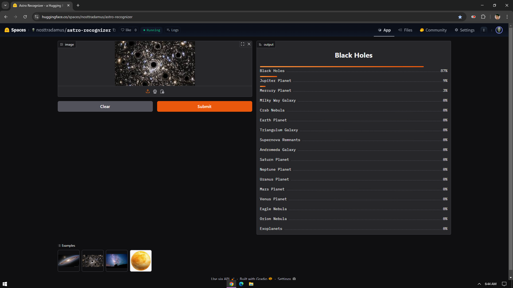

# 🌌 Astro-Recognizer  
An end-to-end image classification model covering data collection, cleaning, model training, deployment, and API integration.  

---

## 🚀 The model classifies 17 different types of astronomical elements:  

### 🌠 Galaxies & Nebulae  
> **These celestial wonders contain billions of stars, gas, and dust, shaping the grand structure of the universe.**  

| Name                |
|---------------------|
| 🌌 Andromeda Galaxy   |
| 🌌 Milky Way Galaxy   |
| 🌌 Triangulum Galaxy  |
| 🌟 Crab Nebula        |
| 🌟 Eagle Nebula       |
| 🌟 Orion Nebula       |

---

### 🪐 Planets  
> **Planets orbit stars, with some potentially harboring life. Each has unique atmospheres and compositions.**  

| Name      |
|----------|
| 🌍 Earth    |
| 🪐 Jupiter  |
| 🔴 Mars     |
| 🏵️ Mercury  |
| 🔵 Neptune  |
| 🟡 Saturn   |
| 🌀 Uranus   |
| 🟠 Venus    |

---

### 🌑 Others  
> **Mysterious cosmic objects, from collapsed stars to planetary bodies beyond our solar system.**  

| Name           |
|---------------|
| 🕳️ Black Holes   |
| 🪐 Exoplanets    |
| 💥 Supernova Remnants |

---

## 📂 Dataset Preparation  
✅ **Data Collection:** Images were sourced from DuckDuckGo using search terms.  
✅ **DataLoader:** Fastai's `DataBlock API` was used to set up the DataLoader.  
✅ **Data Augmentation:** Fastai's built-in GPU-optimized augmentation was applied.  

📌 **Details available in** [`notebooks/data_prep.ipynb`](notebooks/data_prep.ipynb)  

---

## 🎯 Model Training & Data Cleaning  
⚡ **Training:** Fine-tuned a `ResNet-34` model over 5 epochs (8 times), achieving **~86% accuracy**.  
🧹 **Data Cleaning:** Since data was collected from the web, noise removal was crucial. The `ImageClassifierCleaner` tool from Fastai was used iteratively after each training cycle, except for the final iteration.  

---

## 🚀 Model Deployment  
The trained model is deployed on **Hugging Face Spaces** using Gradio.  

📌 **Implementation:** [`deployment/`](deployment/)  
🔗 **Live Demo:** [Hugging Face App](https://huggingface.co/spaces/nosttradamus/astro-recognizer)  

  

---

## 🌍 API Integration with GitHub Pages  
The deployed model is **integrated with GitHub Pages** for easy access.  

🔗 **Live Website:** [Astro Recognizer](https://shaek666.github.io/Astro-Recognizer/)  
📂 **Implementation details:** Available in the [`docs`](docs/) folder.  

---

---

🌟 _Enjoy exploring the universe through AI!_ 🚀✨

